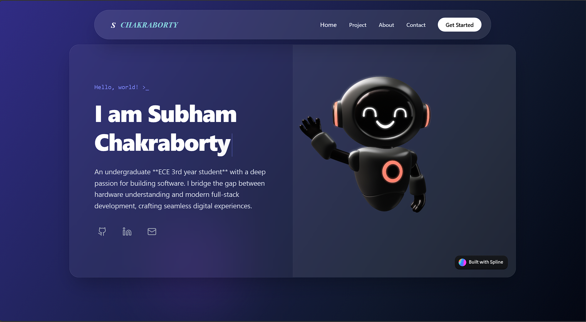

# Subham Chakraborty - Portfolio 🚀

A modern and responsive **personal portfolio website** built using **React** and **Tailwind CSS**, featuring a clean UI and a **Web3-powered contact form** for decentralized interaction.

## ✨ Features

* ⚛️ Built with **React** for a fast and dynamic user experience
* 🎨 Styled using **Tailwind CSS** for a clean, modern, and responsive design
* 🌐 **Web3 Contact Form** for secure and decentralized message submission
* 📱 Fully responsive across desktop, tablet, and mobile devices
* 🧩 Modular and reusable components

## 🛠️ Tech Stack

* **Frontend:** React
* **Styling:** Tailwind CSS
* **Build Tool:** Vite 

## 📂 Project Structure

```
my-portfolio/
├── src/
│   ├── components/
│   ├── pages/
│   ├── assets/
│   ├── App.jsx
│   └── main.jsx
├── public/
├── package.json
└── README.md
```

## 🚀 Getting Started

### 1️⃣ Clone the repository

```bash
git clone https://github.com/subham-oss/my-portfolio
cd my-portfolio
cd frontend
```

### 2️⃣ Install dependencies

```bash
npm install
```

### 3️⃣ Run the development server

```bash
npm run dev
```

The app will run at: `http://localhost:5173/`

## 🌍 Live Demo

🔗 [my-portfolio-nu-gray-34.vercel.app](https://my-portfolio-nu-gray-34.vercel.app/)

## 📸 Screenshots



## 🔮 Future Improvements

* Improve Web3 form validation
* Add animations using Framer Motion

## 📬 Contact

If you'd like to connect or collaborate:

* GitHub: [username](https://github.com/subham-oss)
* LinkedIn: [LinkedIn](https://www.linkedin.com/in/subham448/)
* Email: chakrabortysubham448@gmail.com

---

⭐ If you like this project, don’t forget to give it a star!
